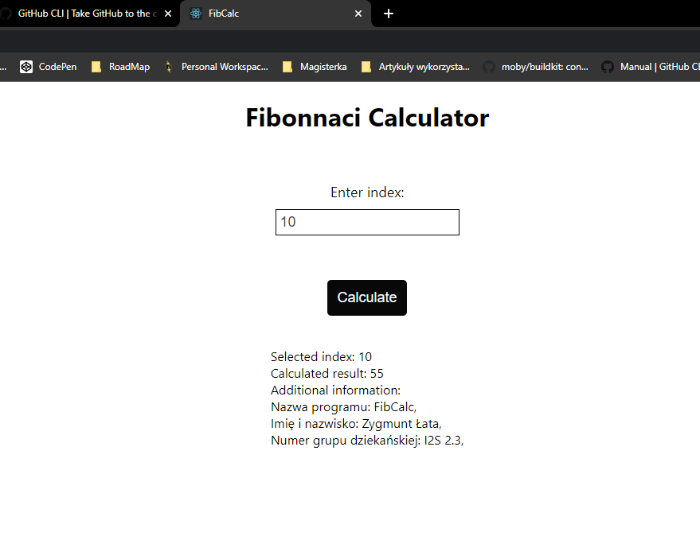

# Zadanie nr 1 - Aplikacja FibCalc

#### Opracował: Zygmunt Łata, Grupa: I2S 2.3

## Table of contents
* [Ad p.1](#ad-p1)
* [Ad p.2](#ad-p2)
* [Ad p.3](#ad-p3)
* [Ad p.4](#ad-p4)

## Ad p.1
W programie FibCalc do obliczenia wartości n-tego wyrazu ciągu Fibonacciego 
zaimplementowany został algorytm wykorzystujący wzór Bineta.

Uproszczony wzór wygląda następująco:

```
Fn = 1 / sqrt(5) * ( (1 + sqrt(5)) / 2 ) ** n

phi = (1 + sqrt(5)) / 2
Fn = phi ** n / sqrt(5)

Symbol ** oznacza potęgowanie, phi jest podstawą, a n wykładnikiem potęgowania
```

Lista poleceń tworzących środowisko pracy na GitHub.

Inicjalizacja repozytorium:
```
git init
git add *
git commit -m "config"
git branch -m main
```

Logowanie do GitHub:
```
Windows PowerShell:
Get-Content C:\Users\zygmu\Desktop\DockerAuth\token_github.txt | gh auth login --with-token

Linux:
gh auth login --with-token < C:\Users\zygmu\Desktop\DockerAuth\token_github.txt
```

Weryfikacja poprawności logowania:
```
gh auth status
```

Inicjalizacja repozytorium cd.:
```
gh repo create FibCalc --public --remote=FibCalc --source=. --push
```

Efekt działania wykonanych poleceń:


## Ad p.2
Aplikacja FibCalc składa się z dwóch oddzielnych aplikacji:
* backendowej - aplikacja Symfony (w języku PHP),
* frontenowej - aplikacja React (w języku JavaScript).

Do działania wykorzystuje trzy serwisy:
* serwer API, wykorzystujący serwer Nginx, który serwuje backend aplikacji,
* serwer PHP, wykorzystany jako język programowania do działania aplikacji backendowej,
* serwer Client, wykorzystujący serwer Nginx, który serwuje frontend aplikacji.

Do budowy obrazów poszczególnych serwisów wykorzystano oddzielne pliki Dockerfile
wraz z plikami konfiguracyjnymi dla każdego z serwisów. Serwisy zostały zdefiniowane 
w pliku docker-compose.yml.

Do zbudowania obrazów serwisów i ich uruchomienia, zastosowano następujące polecenie:

```
docker-compose up -d
```

Efekt działania wykonanego polecenia:


Działanie aplikacji:




## Ad p.3

Budowane obrazy Docker wypychane do repozytorium DockerHub oraz 
GitHub Container Registry wydawane są zgodnie z zasadami wersjonowania 
semantycznego (Semver).

W oparciu o przyjętą konwencję nazewnictwa zbudowanych obrazów, wypychane
będą z następującym tagiem mającym postać: nazwa_serwisu-MAJOR.MINOR.PATCH.
Zastosowano następujący sposób ze względu na to, że wypychane obrazy są 
przechowywane w tym samym repozytorium zarówno na DockerHub, jak i również na
GitHub Container Registry.

Dla DockerHub: user/app:nazwa_serwisu-MAJOR.MINOR.PATCH

Dla GitHub Container Registry: ghcr.io/user/app:nazwa_serwisu-MAJOR.MINOR.PATCH

W skrócie:
* MAJOR, są to zmiany, które nie są niekompatybilne z API,
* MINOR, są to zmiany związane z dodaniem nowej funkcjonalności, 
która jest kompatybilna z poprzednimi wersjami,
* PATCH, są to zmiany związane z naprawieniem błędu/błędów przy 
zachowaniu kompatybilności wstecznej.

Zasady wersjonowania opisane zostały na stronie: https://semver.org/lang/pl/.


Ad. p3. Wystarczy sam plik fib.yml na repozytorium GitHub oraz krótki opis 
przyjętej realizacji nazewnictwa obrazów zgodnie z metodą semver oraz 
zasady wykorzystania repo ghcr.io w pliku fib.yml.

D: W pliku fib.yml należy zdeklarować i wykorzystać zasadę nazywania budowanych
# obrazów według metody.

## Ad p.4
